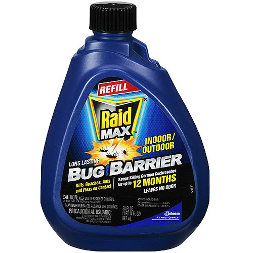
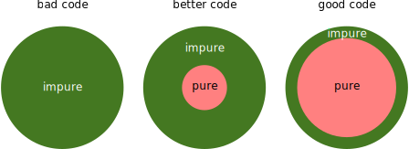

layout: true
class: middle, inverse

---

# Modular code development

## [Radovan Bast](http://bast.fr)

### [NeIC](https://neic.nordforsk.org)/ [UiT The Arctic University of Norway](https://uit.no)

Text is free to share and remix under [CC-BY-SA-4.0](https://creativecommons.org/licenses/by-sa/4.0/).

Code examples: [MIT license](http://opensource.org/licenses/mit-license.html)

Credits: [Jonas Juselius](https://github.com/juselius),
[Roberto Di Remigio](http://totaltrash.xyz),
[Ole Martin Bjørndalen](https://github.com/olemb)

---

layout: false

## Questions

- What best practices can you recommend to arrive at well structured, modular
  code in your favourite programming language?
- What would you recommend your colleague who starts in the same programming language?
- How do you deal with code complexity in your projects?

### First some food for thought ...

---

## Simple vs. easy


---

## [The tar pit](https://github.com/papers-we-love/papers-we-love/blob/master/design/out-of-the-tar-pit.pdf)

- Over time software tends to become harder and harder to reason about
- Small changes become harder to implement
- .emph[Bugs start appearing in unexpected places]
- More time is spent debugging than developing
- Complexity strangles development because it does not scale well

(Slide adapted from [Complexity in software development by Jonas Juselius](https://github.com/scisoft/complexity))

---

## Modularity and composition

- .emph[Build complex behavior from simple components]
- We can reason about the components and the composite
- Composition is key to managing complexity
- Modularity does not imply simplicity, but is enabled by it


(Slide taken from [Complexity in software development by Jonas Juselius](https://github.com/scisoft/complexity))

---

## Purity

- Pure functions have no notion of state: They take input values and return
  values
- .emph[Given the same input, a pure function *always* returns the same value]
- Function calls can be optimized away
- Pure function == data



(Slide taken from [Complexity in software development by Jonas Juselius](https://github.com/scisoft/complexity))

---

## Example: pure vs. stateful

### a) pure: no side effects

```python
def fahrenheit_to_celsius(temp_f):
    temp_c = (temp_f - 32.0) * (5.0/9.0)
    return temp_c

temp_c = fahrenheit_to_celsius(temp_f=100.0)
print(temp_c)
```

### b) stateful: side effects

```python
f_to_c_offset = 32.0
f_to_c_factor = 0.555555555
temp_c = 0.0

def fahrenheit_to_celsius_bad(temp_f):
    global temp_c
    temp_c = (temp_f - f_to_c_offset) * f_to_c_factor

fahrenheit_to_celsius_bad(temp_f=100.0)
print(temp_c)
```

---

## Pure functions are easier to

- Test
- Understand
- Reuse
- Parallelize
- Simplify
- Optimize
- Compose

### Examples

Mathematical functions:

$$f(x, y) = x - x^2 + x^3 + y^2 + xy$$

$$(f \circ g)(x) = f(g(x))$$

Unix shell:

```shell
$ cat somefile | grep somestring | sort | uniq | ...
```

---

## Recommendations

- I/O is impure
- Keep I/O on the outside and connected
- Keep the inside of your code pure/stateless



---

## Divide and conquer

- Split the code up
- Construct your program from parts:
  - functions
  - modules
  - packages (Python) or libraries (C or or C++ or Fortran)

---

## Functions, functions, functions

- Build your code from functions
- Break your code down to more functions
  - if you have too many levels of indentation
  - if a function gets too long
  - if a function does more than one thing
  - if you find it hard to name a function

---

## Encapsulation

- Hide internals by language or by convention (header file in C/C++,
  public/private in Fortran, underscores in Python)
- "Python has no locked doors; it's a consenting adults language.
  If you open the door you're responsible for what you see." [R. Hettinger]
- Expose the "what", hide the "how"

## Import and export

- Import as little as possible
- Export as little as possible

---

## Simplicity and clarity before elegance before efficiency

### Avoid premature optimization

- Do not optimize
- If you have to optimize, optimize later
- If you have to optimize, measure, do not guess

### Simple is better than complex

- If you cannot understand or explain a function on a cold gray Monday morning before coffee, it is too complex. (Quote adapted from [Pieter Hintjens, Social Architecture, 2009](https://www.gitbook.com/book/hintjens/social-architecture/details))
- "Only God and I knew": https://twitter.com/farbodsaraf/status/1006215492607111168

---

## Formatting and styling

### Python

- Follow [PEP8](https://www.python.org/dev/peps/pep-0008/)
- Check with pycodestyle
- Autoformat with https://github.com/google/yapf

### C/C++

- Autoformat with [ClangFormat](https://clang.llvm.org/docs/ClangFormat.html)

### Other languages

- [Please complete this list by sending pull requests]

---

## Project layout

- Documentation sources **always** in the same repository as the code! Often under `doc/`.
- Tests either close to the implementation or in own directory `test/` or `tests/`.
- Sources under `src/` unless it is a Python package, then under `packagename/`.
- It is possible to nest Git repositories
  using [Git submodules](https://git-scm.com/book/en/v2/Git-Tools-Submodules).

### Python

- Collect related functions into modules.
- Collect related modules into packages.

### Fortran

- One module per file. File name equals module name.

### C/C++

- Separate interface files and implementation files.

### R

- use [devtools](https://github.com/r-lib/devtools) to develop packages
- [devtools](https://github.com/r-lib/devtools) wraps around packages to generate tests ([testthat](https://github.com/r-lib/testthat)) and documentation ([roxygen2](https://github.com/klutometis/roxygen))

---

## Conclusions

- Divide and isolate
- Introduce tests early
- .emph[Compose your code out of pure functions]
- Prefer immutable data structures (fun fact: Git commits are immutable)
- Do not overuse classes

---

## Discuss in a group

- What best practices can you recommend to arrive at well structured, modular
  code in your favourite programming language?
- What would you recommend your colleague who starts in the same programming language?
- How do you deal with code complexity in your projects?

### Write down your findings in a shared document

- Later we will discuss these together
- We can share and discuss our personal experiences
