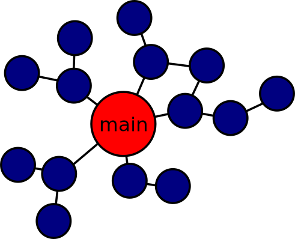
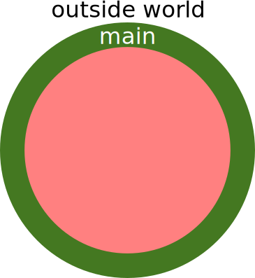

name: inverse
layout: true
class: middle, inverse

---

# Modular code development

## [Radovan Bast](http://bast.fr)

### [NeIC](https://neic.nordforsk.org)/ [UiT The Arctic University of Norway](https://uit.no)

Text is free to share and remix under [CC-BY-SA-4.0](https://creativecommons.org/licenses/by-sa/4.0/).

Code examples: [MIT license](http://opensource.org/licenses/mit-license.html)

Credits: [Jonas Juselius](https://github.com/juselius),
         [Roberto Di Remigio](http://totaltrash.xyz),
         [Ole Martin Bjørndalen](https://github.com/olemb)

---

layout: false

## Simple vs. easy


---

## [The tar pit](http://shaffner.us/cs/papers/tarpit.pdf)

- Over time software tends to become harder and harder to reason about
- The code base easily becomes untidy ("I'll fix it later")
- Small changes become harder to implement
- Hacks and workarounds trump design
- Bugs start appearing in unexpected places
- More time is spent debugging than developing
- Complexity strangles development because it does not scale well

(Slide adapted from [Complexity in software development by Jonas Juselius](https://github.com/scisoft/complexity))

---

## Modular design is good

### Examples

- Lego
- Car manufacturing
- Design of your phone or laptop
- Modular composition when you order a laptop
- Success of USB
- Study programs

### Advantages

- Separation of concerns
- Composability
- Leveraging functionality

---

## Prefer loose coupling and high cohesion

- Strong coupling


- Loose coupling
    - Easier to reassemble
    - Easier to understand


---

## Prefer loose coupling and high cohesion

- Low cohesion: difficult to maintain, test, reuse, or even understand
    - Non-cohesive code introduces unnecessary dependencies
    - Swiss army knife modules


- High cohesion: robust, reliable, reusable, understandable
    - **Do one thing only and do it well**
    - API of cohesive code changes less over time
    - Power of the Unix command line is a set of highly cohesive tools
    - Microservices


---

## Purity

- Pure functions have no notion of state: They take input values and return
  values
- Given the same input, a pure function *always* returns the same value
- Function calls can be optimized away
- Pure function == data


(Slide taken from [Complexity in software development by Jonas Juselius](https://github.com/scisoft/complexity))

---

## Example: pure vs. stateful

### a) pure

```python
# function which computes the body mass index
def get_bmi(mass_kg, height_m):
    return mass_kg/(height_m**2)

# compute the body mass index
bmi = get_bmi(mass_kg=90.0, height_m=1.91))
```

### b) stateful

```python
mass_kg = 90.0
height_m = 1.91
bmi = 0.0

# function which computes the body mass index
def get_bmi():
    global bmi
    bmi = mass_kg/(height_m**2)

# compute the body mass index
get_bmi()
```

---

## .red[function: input $\rightarrow$ output]

## f: $x \rightarrow x^2$

## blender: fruits $\rightarrow$ shake

## oven: (ingredients, temperature, time) $\rightarrow$ cake

## .blue[Pure functions are easier to]

- Test
- Understand
- Reuse
- Parallelize
- Simplify
- Optimize

---

## Composition

- Build complex behavior from simple components
- We can reason about the components and the composite
- Composition is key to managing complexity
- Modularity does not imply simplicity, but is enabled by it


(Slide taken from [Complexity in software development by Jonas Juselius](https://github.com/scisoft/complexity))

---

## One way to look at your code



- The main function calls other functions

---

## Another way to look at your code



- The main function ("program" in Fortran) is on the outside shell

---

## Recommendations

- Keep I/O on the outside and connected
- Keep the inside of your code pure/stateless


---

## Divide and conquer

- Split the code up
- Construct your program from parts:
  - functions
  - modules
  - packages (Python) or libraries (C or or C++ or Fortran)

---

## Functions, functions, functions

- Build your code from functions
- Break your code down to more functions
  - if you have too many levels of indentation
  - if a function gets too long
  - if a function does more than one thing
  - if you find it hard to name a function
- A function that performs a single operation is simpler to
  understand, test, and reuse
- A function that does not fit on one screen is too long

---

## Import and export

- Import as little as possible
- Export as little as possible

---

## Encapsulation

- Hide internals by language or by convention (header file in C/C++,
  public/private in Fortran, underscores in Python)
- "Python has no locked doors; it's a consenting adults language.
  If you open the door you're responsible for what you see." [R. Hettinger]
- Expose the "what", hide the "how"

## Documentation

- Separate the "what it can do" from "how is it implemented"
- Document your API
- Version your API ([semantic](http://semver.org) or [sentimental](http://sentimentalversioning.org)
  or [romantic](https://github.com/jashkenas/backbone/issues/2888#issuecomment-29076249) versioning)

---

## Simplicity and clarity before elegance before efficiency

### Avoid premature optimization

- Do not optimize
- If you have to optimize, optimize later
- If you have to optimize, measure, do not guess

### Simple is better than complex

- If you cannot understand or explain a function on a cold gray Monday morning before coffee, it is too complex. (Quote adapted from [Pieter Hintjens, Social Architecture, 2009](https://www.gitbook.com/book/hintjens/social-architecture/details))

---

## Conclusions

- Modular and well structured code is easy to test
- Entangled code is difficult to test
- Introduce testing early - it will **automatically guide you towards a modular and well structured code**
- Compose your code out of **pure functions**
- Prefer immutable data structures, do not overuse classes
